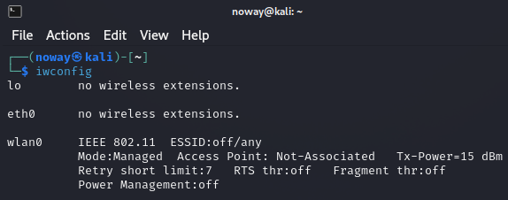

# Manual Guide

We recommend to use Kali distro because Aircrack-ng is preinstalled.

Use this command to view network cards

```shell-session
┌(root💀kali)-[~]
│
┕$ iwconfig
```

<figure><figcaption></figcaption></figure>

Start&#x20;
